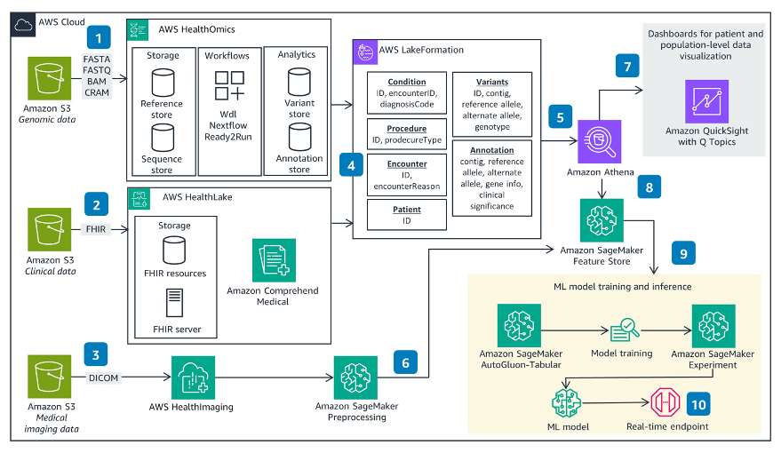

## Multimodal Data Analysis with AWS Health and Machine Learning Services

This repository contains code samples related to the AWS [Guidance for Multimodal Data Analysis with AWS Health and Machine Learning Services](https://aws.amazon.com/solutions/guidance/multi-modal-data-analysis-with-aws-health-and-ml-services/). You can follow the given instructions to build an end-to-end framework for storing, integrating, and analyzing genomic, clinical, and medical imaging data. 

As an example, we will use the [Synthea Coherent Data Set](https://registry.opendata.aws/synthea-coherent-data/), an open-source, synthetic dataset that includes FHIR resources, MRI DICOM images, genomic data, physiological data (i.e., ECGs), and simple clinical notes. All the data types are linked together by FHIR. For the purpose of demonstration, we already converted the genomic data (originally released as CSV files with variant and annotation information) to VCF format, that is compatible with AWS HealthOmics. Similarly, we reformatted the clinical data into NDJSON files that comply with AWS HealthLake. For ease of use, we have made this derived dataset available on an Amazon S3 bucket (s3://guidance-multimodal-hcls-healthai-machinelearning) with public access. Since the Coherent Data Set focuses on cardiovascular disease, we consider the use case of predicting patients' outcomes, such as hypertension, stroke, coronary heart disease, and Alzheimer's disease. 

#### Architecture Overview 

The following diagram provides an overview of the architecture and the steps followed to ingest, store, integrate, and analyze multimodal data leveraging AWS services. 

#### Instructions 

All of the data analytics and AI modeling are done using [Amazon SageMaker](https://aws.amazon.com/sagemaker/). You can create the Amazon SageMaker domain by 1-click deployment (If you have S3 Bucket or IAM role with the same names used in the template, please adjust the template parameter values for them):

  

1. Store multimodal data with purpose-built Health AI services ([AWS HealthOmics](https://aws.amazon.com/omics/), [AWS HealthLake](https://aws.amazon.com/healthlake/), and [AWS HealthImaging](https://aws.amazon.com/healthlake/imaging/))
    * To store each data type in the purpose-built Health AI service, follow the artifacts in the corresponding folders. 
        * genomic - Run the notebook store-multimodal-data/genomic/store-analyze-genomicdata-with-awshealthomics.ipynb. This creates AWS HealthOmics data stores (Reference Store, Variant Store, and Annotation Store) to import reference genome, VCF files, and ClinVar annotation file. 
        * clinical - Follow the instructions in store-multimodal-data/clinical/README.md to create AWS HealthLake data store and import NDJSON files. 
        * medical imaging - First, run the notebook store-multimodal-data/medical_imaging/store-imagingdata-with-awshealthimaging.ipynb to create AWS HealthImaging data stores and import DICOM files. Then, run preprocess-multimodal-date/medical-imaging/imaging-radiomics.ipynb to generate radiomic features from multimple images in parallel using Amazon SageMaker Preprocessing. 

2. Preprocess and analyze multimodal data with [AWS Lake Formation](https://aws.amazon.com/lake-formation/), [Amazon Athena](https://aws.amazon.com/athena/), and [Amazon SageMaker Feature Store](https://aws.amazon.com/sagemaker/feature-store/?sagemaker-data-wrangler-whats-new.sort-by=item.additionalFields.postDateTime&sagemaker-data-wrangler-whats-new.sort-order=desc)
    * To prepare and analyze the multimodal data for downstream analysis (eg. querying with Amazon Athena, training a machine learning (ML) model with Amazon SageMaker), follow the artifacts in the corresponding folders.
        * genomic - Run the notebook preprocess-multimodal-data/genomic/preprocess-genomic.ipynb to execute feature engineering and store the final set of genomic features in SageMaker Feature Store, a fully managed service for machine learning features. 
        * clinical - Run the notebook preprocess-multimodal-data/clinical/preprocess-clinical.ipynb to execute feature engineering and store the final set of clinical features in SageMaker Feature Store. 
        * medical imaging - Run the notebook preprocess-multimodal-data/medical-imaging/preprocess-imaging.ipynb to execute feature engineering and store the final set of radiomic features in SageMaker Feature Store.

    At the end of this step, you have created three Feature Groups in SageMaker Feature Store, one for each data modality. We will use these features in the following steps to train a machine learning model and build visualization dashboards. 

3. Build, train, test, and deploy machine learning models with Amazon SageMaker 
    * For the given use case of patients' outcome prediction, we will use [SageMaker AutoGluon](https://docs.aws.amazon.com/sagemaker/latest/dg/autogluon-tabular.html), an AutoML framework that ensembles multiple ML models to improve predictive performance. To train and test the ML model on the multimodal feature set, run the notebook train-test-ml-model/train-test-model.ipynb. This generates evaluation metrics (accuracy, precision, recall, and f1 score) for the four outcomes (hypertension, stroke, coronary heart disease, and Alzheimer's disease).

4. Create data visualization dashboards with Amazon QuickSight 
    * Follow the instructions in visualization-dashboard/README.md to use the interactive dashboards and get a comprehensive view of patients across all three data modalities. These dashboards mitigate the challenge of data siloes and help end users (eg. clinicians, bioinformaticians, radiologists) easily access, view, and compare clinical, genomic, and medical imaging data across individual patients and cohorts. 

#### Security

See [CONTRIBUTING](CONTRIBUTING.md#security-issue-notifications) for more information.

#### License

This library is licensed under the MIT-0 License. See the LICENSE file.

